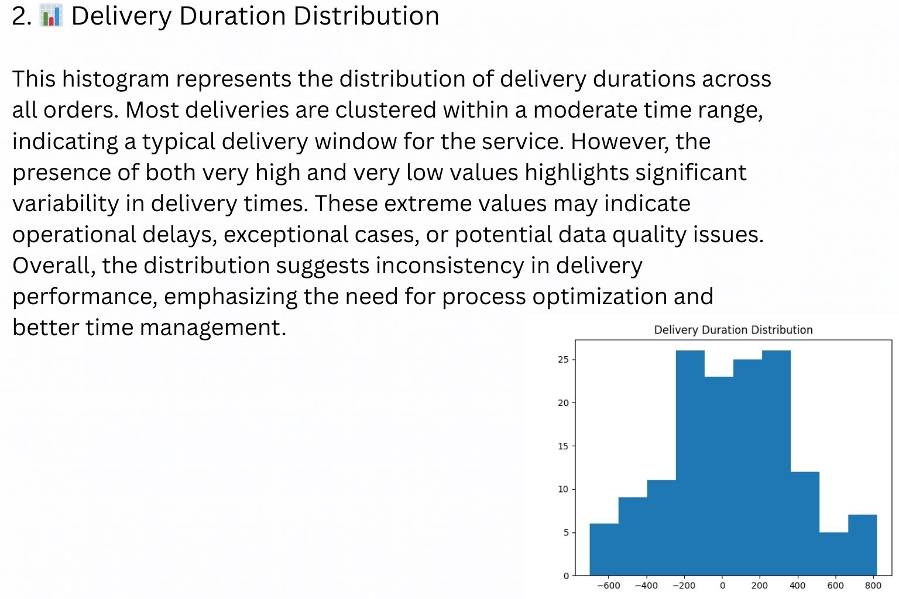
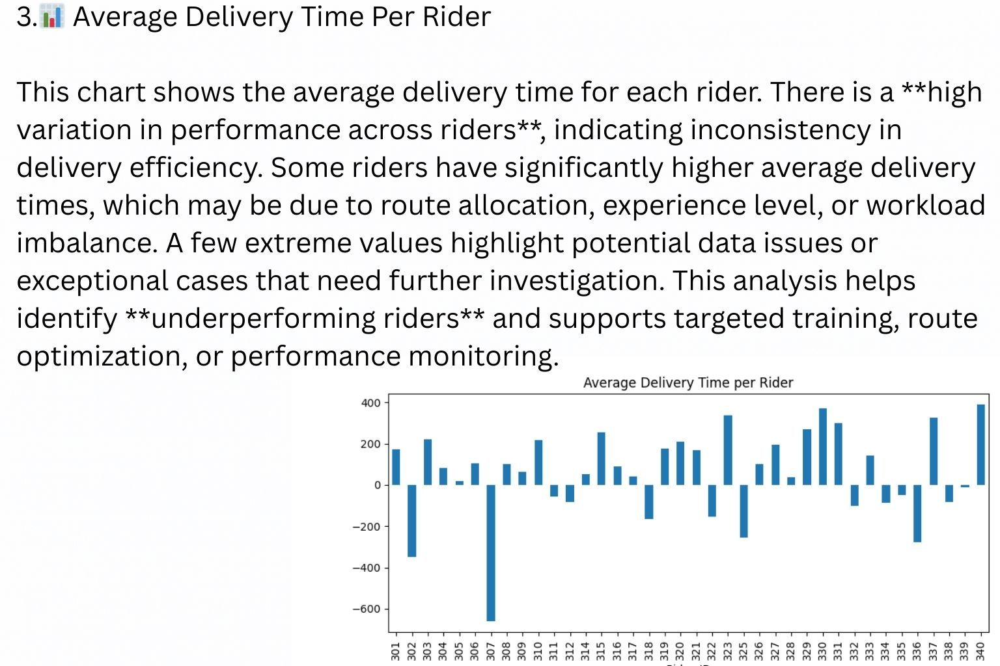
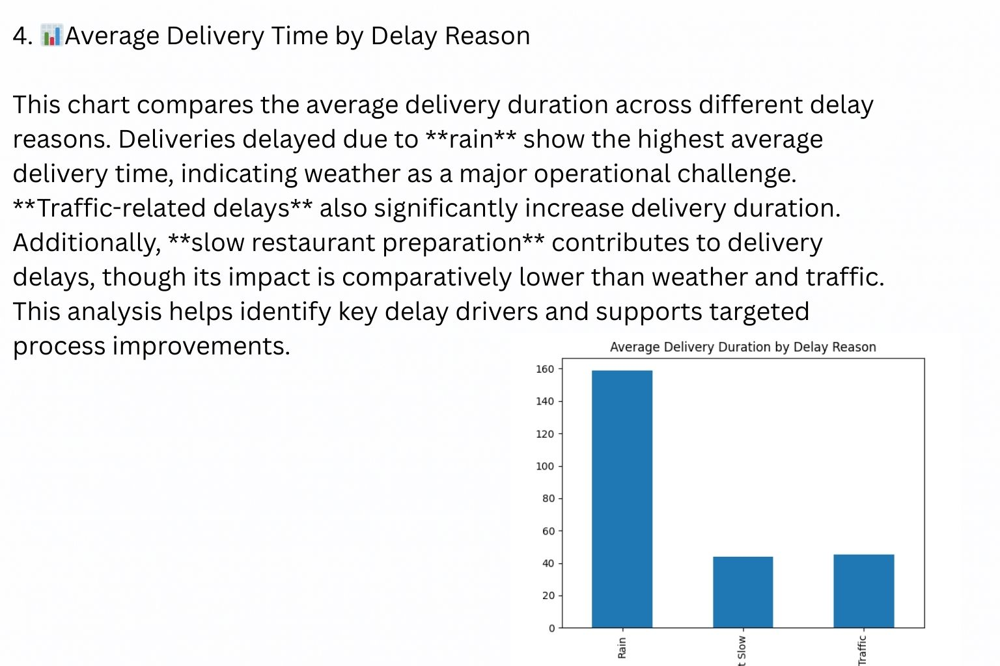
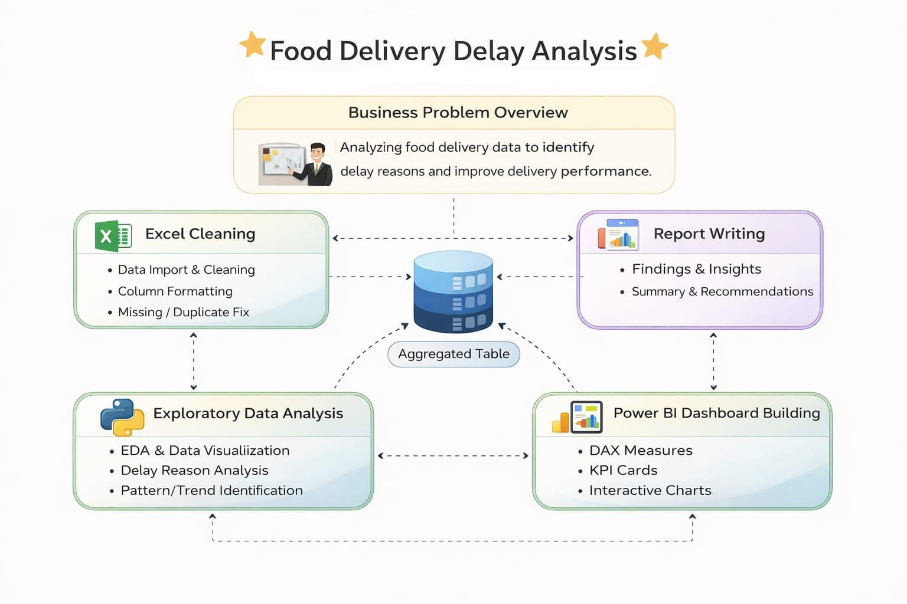
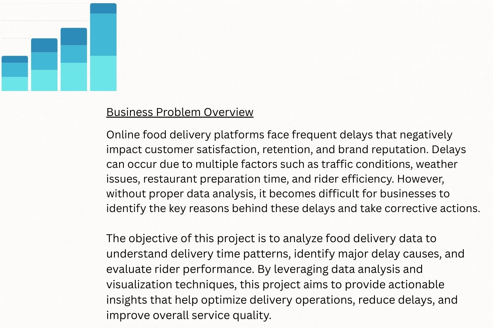
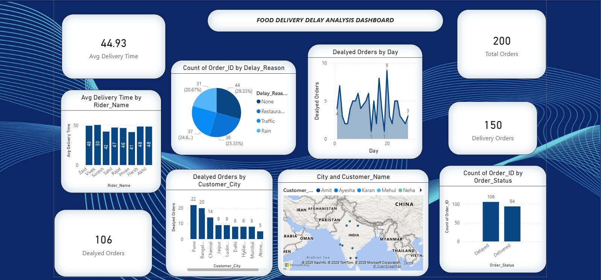

## 🍔 Food Delivery Delay Analysis  
**End-to-End Data Analysis Project | Excel • SQL • Python • Power BI**

---

## 📌 Brief One-Line Summary
An end-to-end data analysis project to identify, analyze, and visualize the key factors causing food delivery delays using Excel, SQL, Python (EDA), and Power BI.

---

## 📑 Table of Contents
- [Project Overview](#project-overview)
- [Business Problem Statement](#business-problem-statement)
- [Dataset](#dataset)
- [Tools & Technologies](#tools--technologies)
- [Methodology](#methodology)
- [Exploratory Data Analysis (Python)](#exploratory-data-analysis-python)
- [SQL Analysis](#sql-analysis)
- [Key Insights](#key-insights)
- [Power BI Dashboard](#power-bi-dashboard)
- [Results & Conclusion](#results--conclusion)
- [Future Work](#future-work)
- [Author & Contact](#author--contact)

---

## 📖 Project Overview
Food delivery platforms face frequent delays that negatively impact customer satisfaction and business growth.  
This project analyzes delivery data to identify **where, why, and how delays occur**, focusing on riders, restaurants, delivery duration, and delay reasons.

---

## 🎯 Business Problem Statement
- Why are food deliveries getting delayed?
- Are delays caused by **riders, restaurants, or operational issues**?
- Which riders and delay reasons contribute most to late deliveries?
- How can businesses reduce delivery time and improve customer experience?

---

## 📂 Dataset
- Source: Simulated / Cleaned food delivery dataset
- Format: CSV & Excel
- Records include:
  - Order details
  - Delivery time
  - Rider information
  - Delay reasons
  - Restaurant & order timestamps

---

## 🛠 Tools & Technologies
- **Excel** – Data cleaning & preprocessing  
- **SQL** – Query-based analysis & aggregations  
- **Python** – Exploratory Data Analysis (EDA)  
- **Power BI** – Interactive dashboard & visualization  

---

## 🔍 Methodology
1. Data cleaning and preparation using Excel  
2. Exploratory Data Analysis using Python  
3. SQL queries to analyze delay reasons and rider performance  
4. Visualization of insights using Power BI dashboards  

---

## 🐍 Exploratory Data Analysis (Python)
Python was used to:
- Analyze delivery duration distribution  
- Identify outliers in delivery times  
- Compare rider-wise average delivery times  

📊 **Delivery Duration Distribution**  

📊 **Average Delivery Time per Rider**  

---

## 🧠 SQL Analysis
SQL queries were used to:
- Count delay reasons
- Calculate average delivery time by delay reason
- Identify riders with consistently high delivery times

📊 **Delay Reason Count**  

📊 **Average Delivery Time by Delay Reason**  

---

## 📈 Key Insights
- Certain riders consistently take **significantly more time** to deliver orders  
- **Restaurant preparation delays** contribute heavily to overall delay  
- Peak-time orders show higher delivery duration variance  
- Operational and coordination delays are recurring patterns  

📌 **Business Problem Overview**  

---

## 📊 Power BI Dashboard
An interactive Power BI dashboard was created to visualize:
- Delay reasons
- Rider performance
- Delivery duration trends
- Overall operational bottlenecks

🖥 Dashboard Preview  

---

## ✅ Results & Conclusion
- Delivery delays are not random; they are **pattern-driven**
- Restaurant delays and specific riders are major contributors
- Data-driven monitoring can significantly reduce late deliveries
- Power BI dashboards enable faster decision-making for operations teams

---

## 🔮 Future Work
- Add real-time data integration  
- Apply predictive models for delay forecasting  
- Include customer satisfaction metrics  
- Automate alerts for high-delay riders or restaurants  

---

## 👤 Author & Contact
**Mehul Sharma**  
📧 Email: mehulsharma19feb@gmail.com 
🔗 GitHub: https://github.com/MehulSharma2000  
🔗 LinkedIn: www.linkedin.com/in/mehul-sharma-07207a399

---

⭐ If you like this project, don’t forget to star the repository!
